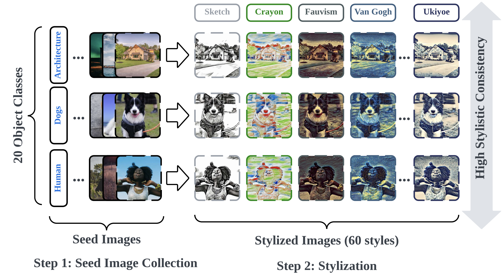

<div align='center'>
 
# [UnlearnCanvas: A Stylized Image Dataset to Benchmark Machine Unlearning for Diffusion Models](https://unlearn-canvas.netlify.app)

[](https://arxiv.org/abs/2402.11846)
[](https://unlearn-canvas.netlify.app)
[](https://huggingface.co/datasets/OPTML-Group/UnlearnCanvas)
[](https://huggingface.co/spaces/OPTML-Group/UnlearnCanvas-Benchmark)
[](https://youtu.be/lC_R_b9ZiH8)
[](https://opensource.org/licenses/MIT)

<table align="center">
  <tr>
    <td align="center"> 
       
      <br>
      <em style="font-size: 18px;">  <strong style="font-size: 18px;">Figure 1:</strong> An overview of the structure and key attributes of the UnlearnCanvas dataset.</em>
    </td>
  </tr>
</table>
</div>

Welcome to the official repository for the paper, [UnlearnCanvas: A Stylized Image Dataset for Benchmarking Machine Unlearning in Diffusion Models](https://arxiv.org/abs/2402.11846). This dataset encompasses source codes and essential checkpoints for all experiments presented in the paper, including machine unlearning and style transfer.


## Abstract

The rapid advancement of diffusion models (DMs) has not only transformed various real-world industries but has also introduced negative societal concerns, including the generation of harmful content, copyright disputes, and the rise of stereotypes and biases. To mitigate these issues, machine unlearning (MU) has emerged as a potential solution, demonstrating its ability to remove undesired generative capabilities of DMs in various applications. However, by examining existing MU evaluation methods, we uncover several key challenges that can result in incomplete, inaccurate, or biased evaluations for MU in DMs. To address them, we enhance the evaluation metrics for MU, including the introduction of an often-overlooked retainability measurement for DMs post-unlearning. Additionally, we introduce UnlearnCanvas, a comprehensive high-resolution stylized image dataset that facilitates us to evaluate the unlearning of artistic painting styles in conjunction with associated image objects. We show that this dataset plays a pivotal role in establishing a standardized and automated evaluation framework for MU techniques on DMs, featuring 7 quantitative metrics to address various aspects of unlearning effectiveness. Through extensive experiments, we benchmark 5 state-of-the-art MU methods, revealing novel insights into their pros and cons, and the underlying unlearning mechanisms. Furthermore, we demonstrate the potential of UnlearnCanvas to benchmark other generative modeling tasks, such as style transfer.

## 1) Getting Started
This repository contains the usage instructions for UnlearnBench dataset and the source code to reproduce all the experiment results in the paper. In particular, this project contains the following subfolders.

- [diffusion_model_finetuning](./diffusion_model_finetuning): This folder contains the instructions and the source code to fine-tune the diffusion models on the UnlearnCanvas dataset. We provide the fine-tuning scripts for the text-to-image model StableDiffusion and the image-editing model [InstructPix2Pix]() as an example of how this dataset can be used. In particular, we provide the fine-tuning scripts for both the `diffuser` and the `compvis` code structures. 
- [machine_unlearning](./machine_unlearning): This folder contains the instructions and the source code to perform machine unlearning on the fine-tuned diffusion models. In particular, we include the source code and the scripts of five machine unlearning methods reported in the paper (ESD, CA, UCE, FMN, SalUn, and SA). These source codes are inherited and modified from their original code repo to adapt to the UnlearnCanvas. We also open-sourced the source code used to generate the evaluation set and the evaluation scripts for these experiments.
- [style_transfer](./style_transfer): This folder contains the instructions and the source code to perform style transfer using the UnlearnCanvas dataset, as an example of how UnlearnCanvas can be used for accurate evaluation on more tasks. In particular, we look into in total 9 style transfer methods. For each method, we provide the checkpoints (released by the authors of each method) and the evaluation scripts. 


## 2) UnlearnCanvas Dataset

The UnlearnCanvas Dataset is now publicly available on both [Google Drive](https://drive.google.com/drive/folders/1sJBLhng3I2fD3dbEzxx_Jvm1bMBcMQH7?usp=sharing) and [HuggingFace](https://huggingface.co/datasets/OPTML-Group/UnlearnCanvas)! The dataset contains images across 60 different artistic painting styles and for each style, we provide 400 images across 20 different object categories. The dataset follows a structured of `./style_name/object_name/image_idx.jpg` Each stylized image is painted from the corresponding photo-realistic image, which are stored in the `./Seed_Image` folder. For more details on how to fine-tune diffusion models with UnlearnCanvas, please refer to the [diffusion_model_finetuning](./diffusion_model_finetuning) folder. 

The UnlearnCanvas dataset is designed to facilitate the **quantitative evaluation** of various vision generative modeling tasks, including but are not limited to:

- Machine Unlearning (explored in the paper)
- Style Transfer (explored in the paper)
- Vision In-Context Learning
- Bias Removal for Generative Models
- Out-of-distribution Learning
- ...

The dataset has the following features:

- **High-Resolution Images and Balanced Structure**: The dataset contains super high-resolution images with balanced image numbers across different styles and object types, which are friendly to fine-tuning foundation models, represented by diffusion models.
- **Rich Style and Object Categories**: The dataset contains 60 different artistic painting styles and 20 different object categories. This allows the dataset to be used for a wide range of vision generative modeling tasks.
- **High Stylistic Consistency and Distinctiveness**: The dataset is designed to contain high stylistic consistency and distinctiveness across different styles categories. This attribute is crucial in helping building up an accurate style/object detector, which serves as the foundations of quantitative evaluations for many tasks.

## 3) An Overview on Checkpoints

We provide the key checkpoints used in our experiments in the paper. The checkpoints are publicly available in the [Google Drive Folder](https://drive.google.com/drive/folders/14iztBXs-GoBFVLePC2_psP00YUMK5-cy?usp=sharing). These checkpoints are organized in the following subfolders:

- `diffusion` (**StableDiffusion Fine-tuned on UnlearnBench**): We provide the fine-tuned checkpoints for the StableDiffusion model on the UnlearnCanvas dataset in the format of `compvis` and `diffuser` format (to save your time on transferring them to each other). These checkpoints are used in the machine unlearning experiments in the paper and serve as the testbed for different unlearning methods.
- `classfiers` (**Style/Object Classifier Fine-tuned on UnlearnBench**): We provide the fine-tuned ViT-Large checkpoints for the style and object classifiers on the UnlearnCanvas dataset. These checkpoints are used in the machine unlearning experiments in the paper to evaluate the results after each unlearning method is performed.
- `style_loss_vgg` (**Pretrained Checkpoints for Style Loss Evaluation**): We provide the pretrained checkpoints for the style loss calculation used in the paper.

As for the detailed usage instructions of these checkpoints, please refer to the README files of the corresponding subfolders in this repo. Note, we also provide the pretrained checkpoints for all the style transfer methods, which are discussed in the README files of the corresponding subfolders.

## 4) Environments
Unless otherwise specified, the code will be running in the following environment:
```bash
conda env create -f environment.yaml
```
Please note that there are over 16 applications in this project (fine-tuning on text-to-image/image editing diffusion models, machine unlearning, style transfer), we suggest you to check the README file for each application before using them, in case there are any additional dependencies required.

## 5) Contributors and Credits

### Dataset Contributors

* [Yihua Zhang](https://yihua-zhang.com/)

### Code Contributors
* [Yihua Zhang](https://yihua-zhang.com/)
* [Chongyu Fan](https://a-f1.github.io/)
* [Yimeng Zhang](https://damon-demon.github.io/)

### Credits to the Original Code Repositories
This dataset and the relevant benchmarking experiments are built on the amazing existing code repositories. We would like to express our gratitude to the authors of the following repositories:

* Diffusion Model Fine-Tuning
  * [StableDiffusion](): 
  * [InstructPix2Pix]():
  * [Diffuser]():
* Machine Unlearning
  * [Erasing Concepts from Diffusion Models (ESD)](https://github.com/rohitgandikota/erasing)
  * [Ablating Concepts in Text-to-Image Diffusion Models(CA)](https://github.com/nupurkmr9/concept-ablation):
  * [Unified Concept Editing in Diffusion Models (UCE)](https://github.com/rohitgandikota/unified-concept-editing/tree/main):
  * [Forget-Me-Not: Learning to Forget in Text-to-Image Diffusion Models (FMN)](https://github.com/SHI-Labs/Forget-Me-Not/tree/main):
  * [SalUn: Empowering Machine Unlearning via Gradient-based Weight Saliency in Both Image Classification and Generation (SalUn)](https://github.com/OPTML-Group/Unlearn-Saliency/tree/master):
  * [Selective Amnesia: A Continual Learning Approach for Forgetting in Deep Generative Models (SA)](https://github.com/clear-nus/selective-amnesia):
  * [Concept Semi-Permeable Membrane (SPM)](https://github.com/Con6924/SPM)
  * [Get What You Want, Not What You Don't: Image Content Suppression for Text-to-Image Diffusion Models (SEOT)](https://github.com/sen-mao/SuppressEOT)
  * [EraseDiff: Erasing Data Influence in Diffusion Models (Ediff)](https://github.com/JingWu321/EraseDiff)
  * [Scissorhands: Scrub Data Influence via Connection Sensitivity in Networks (SHS)](https://github.com/JingWu321/Scissorhands)
* Style Transfer
  * [ArtFlow](https://github.com/pkuanjie/ArtFlow)
  * [AdaAttn](https://github.com/Huage001/AdaAttN)
  * [Blip](https://github.com/salesforce/LAVIS/tree/main/projects/blip-diffusion)
  * [Cast](https://github.com/zyxElsa/CAST_pytorch)
  * [IE_Contrast](https://github.com/HalbertCH/IEContraAST)
  * [MAST](https://github.com/NJUHuoJing/MAST)
  * [MCC](https://github.com/diyiiyiii/MCCNet)
  * [SANET](https://github.com/GlebSBrykin/SANET)
  * [StyTr2](https://github.com/diyiiyiii/StyTR-2)


## 4) Cite This Work
```
@article{zhang2024unlearncanvas,
  title={UnlearnCanvas: A Stylized Image Dataset to Benchmark Machine Unlearning for Diffusion Models},
  author={Zhang, Yihua and Zhang, Yimeng and Yao, Yuguang and Jia, Jinghan and Liu, Jiancheng and Liu, Xiaoming and Liu, Sijia},
  journal={arXiv preprint arXiv:2402.11846},
  year={2024}
}
```
