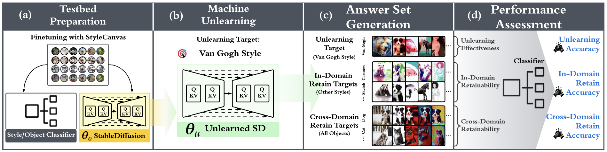

# Benchmarking Machine Unlearning with UnlearnCanvas

This folder contains the scripts and instructions to reproduce the machine unlearning experiments on the UnlearnCanvas dataset. Each subfolder in this directory corresponds to a different machine unlearning experiment. The README file in each subfolder provides the detailed instructions to reproduce the experiments. Here, we provide a brief overview of the experiments and the evaluation scripts used for all the methods.

<div align='center'>
 
<table align="center">
  <tr>
    <td align="center"> 
       
      <br>
      <em style="font-size: 18px;">  <strong style="font-size: 18px;">Figure 1:</strong> An overview of the pipeline to evaluate the machine unlearning methods proposed in our work.</em>
    </td>
  </tr>
</table>
</div>

### Update on Codes for Finer-Scale Unlearning, Robust Evaluation, and Sequential Unlearning

As we released the second version of our paper, we added three additional more challenging unlearning settings to UnlearnCanvas, including the finer-scale unlearning, robust evaluation, and sequential unlearning. Here, we remark that the current code repo has already supported the experiments for finer-scale unlearning and sequential unlearning. Specifically, one can achieve this by replacing the unlearning objectives (*e.g.*, prompt and forget/retain image set if applicable) and adjusting the checkpoint loading from the original model to the last unlearned model. For robust evaluation with adversarial prompts, we refer to the [repo of the UnlearnDiffAtk](https://urldefense.com/v3/__https://github.com/OPTML-Group/Diffusion-MU-Attack__;!!HXCxUKc!0XGlPOg193FkhZ-i0s0bfzquXU3BCfe3lvTILVg37A5TadfyOmpF7IOEJdvWGHMbjVH9Brc9Zqne-XN6z_BQevc$), which requires only minor changes in model loading and the attacking objective. We are sorry for not planning to update the current code repo for a ready-to-use version for these settings, as massive code replications would be unavoidable, if new folders (for each setting) are added to this folder. We are planning a major update on this repo with the code structures being refactored and re-organized to make it easy to use. We are sorry for any inconvenience this might cause.

## Machine Unlearning Evaluations

For each machine unlearning method, we need to

1. **Unlearned Model Preparation.** Traverse all the styles and object classes in the UnlearnCanvas dataset as the unlearning target, and generate the unlearned model for each target. In our paper, we generate 50 (styles) + 20 (objects) unlearned models in total for each method. Please see the corresponding README file in each subfolder for the detailed instructions to generate the unlearned models.

2. **Answer Set Preparation.** For each unlearned model, we will generate a answer set, which contains the sampling results involving all the combinations of style and objects. In particular, the prompt is `An {object} image in {style} style.`, which is the same prompt as the one used for stable diffusion fine-tuning. For each prompt, we sample 5 images with different random seeds. The scripts are provided to generate the answer sheet. For example, regarding the unlearned model from ESD with `Crayon` as the unlearning target, we use:

```bash
cd evaluation
python3 sampling_unlearned_models/esd.py --theme Crayon
```

The script above is based on the default saving paths used in this repo. Otherwise, please revise the corresponding paths in the sampling script. Note, this script is the same as the [script](../diffusion_model_finetuning/sampling/stable_diffusion/[sample_compvis_automated.py](..%2Fdiffusion_model_finetuning%2Fsampling%2Fstable_diffusion%2Fsample_compvis_automated.py)) for the fine-tuned stable diffusion models. Please try not to change the default output directory in the script, as this will ease the following accuracy calculation process.

3. **Unlearning Accuracy and Retaining Accuracy Calculation.** Given the answer set, the evaluation script will be used to calculate the unlearning accuracy and retaining accuracy (including the in-domain and out-of-domain retaining accuracy). In particular, any images generated involving the unlearned target will be considered for unlearning accuracy calculation (the percentage of the images that are not classified into the corresponding style/class). For other images, the retaining accuracy associated with each style/class will be calculated separately using the pretrained style/object classifier. For cases where styles are the unlearning target, the retaining accuracy involving any styles are averaged as the in-domain retaining accuracy, and the retaining accuracy involving all the objects are averaged as the out-of-domain retaining accuracy, and vice versa. We provide the scripts to evaluate the unlearning and retaining accuracy in `evaluation/quantitative/accuracy.py`. Please download the pretrained style and object classifiers from [this link](https://drive.google.com/drive/folders/18dhkXyZQWjdMvlAlxZx3fZhdCZvlj2Hw?usp=sharing) (`cls_model`). For example, to evaluate the answer set with `Crayon` as the unlearning target, the following script can be used:

```bash
cd evaluation;

python3 quantitative/accuracy.py --input_dir PATH_TO_ANSWER_SET --output_dir OUTPUT_DIR --theme Crayon --task style --ckpt PATH_TO_CLASSIFIER_CKPT;
```

The script above will generate the accuracy associated with all the styles and objects in the `OUTPUT_DIR/Crayon/`.

4. **FID Score Calculation**

```bash
    python3 evaluation/fid.py --p1 PATH_TO_DATASET_FOLDER --p2 PATH_TO_ANSWER_SET --output-path PATH_TO_OUTPUT_DIR
```
