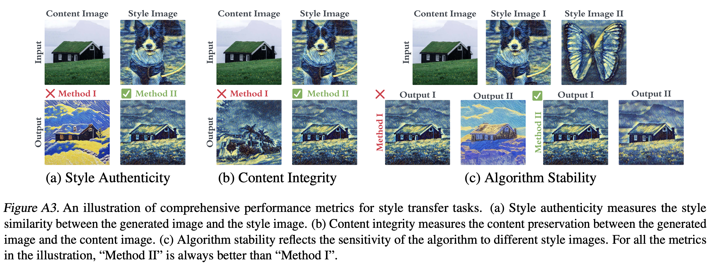

# Benchmarking Style Transfer with UnlearnCanvas

In this folder, we provide the code to benchmark the performance of different style transfer methods on the UnlearnCanvas dataset.

<div align='center'>
 
<table align="center">
  <tr>
    <td align="center"> 
       
      <br>
      <em style="font-size: 18px;">  <strong style="font-size: 18px;">Figure 1:</strong> An overview of the pipeline to evaluate the machine unlearning methods proposed in our work.</em>
    </td>
  </tr>
</table>
</div>

## Preparing The Dataset and Model Checkpoints

In order to perform each method, we need to first download the pretrained checkpoint for the unlearning methods. The detailed instructions for each method can be found in the corresponding directories.

In the meantime, please download the UnlearnCanvas dataset from [Google Drive](https://drive.google.com/drive/folders/1sJBLhng3I2fD3dbEzxx_Jvm1bMBcMQH7?usp=sharing). The HuggingFace version is currently not supported in this task.

## Style Transfer Benchmarking

### Answer Set Generation

For each method, we provide the script `unlearn_canvas_batch_test.py`. The usage for this script is very similar across different methods, but we still provide the detailed instructions in the corresponding directories. This script will generate the answer set for each method for further quantitative evaluation.

### Quantitative Evaluation

Given the answer set, we further calculate the quantitative metrics for each method. The metrics include the following:

* style loss: the difference between the stylistic features of the generated image and the style reference image
* content loss: the difference between the content features of the generated image and the content reference image
* standard deviation: the std values can be calculated with different granularity to reflect the stability of the algorithm from different perspectives.

In order to calculate the style and the content loss, we can either use a pretrained VGG model or our own style/object classification model (ViT-Large). Here, we provide the scripts for both. Our experiment results demonstrate while both models can demonstrate similar relative ranks among the tested methods, our ViT-Large classifier can better differentiate the performance of different methods.

In order to obtain the pretrained checkpoints, please refer to [Google Drive](https://drive.google.com/drive/folders/14iztBXs-GoBFVLePC2_psP00YUMK5-cy?usp=sharing) (`cls_model` and `style_loss_vgg`).

```bash
method=adaattn; python3 evaluation/vit_loss.py --input PATH_TO_ANSWER_SET --output OUTPUT_DIR --benchmark_dir PATH_TO_DATASET_DIR --ckpt PATH_TO_PRETRAINED_CLASSIFIER; 

python3 evaluation/vgg_loss.py --input PATH_TO_ANSWER_SET --output OUTPUT_DIR --benchmark_dir PATH_TO_DATASET_DIR --ckpt PATH_TO_PRETRAINED_VGG;
```


